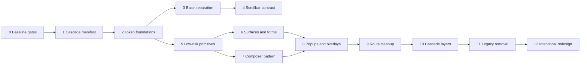

# Site-wide design-system migration roadmap

Status: recommendation only; no phase is authorized by this audit.  
Baseline: `refactor/sitewide-design-system` at `be61f98fd2537d367c757bf9796b11735bc7d193`

## Recommended architecture

The proposed directory shape is directionally correct, but the current repository needs explicit base, pattern and compatibility boundaries:

```text
shared/styles/
  design-system.css              # one manifest/import contract
  tokens/
    primitives.css               # raw color/type/spacing/sizing/motion/z scales
    semantic.css                 # text/surface/border/action/status/focus meanings
    components.css               # component-level defaults only when needed
  base/
    reset.css
    document.css                 # html/body, fonts, selection, links
    typography.css
    native-controls.css          # temporary raw element normalization
  components/
    buttons.css
    icon-buttons.css
    surfaces.css                 # panels/cards
    forms.css
    selects.css
    chips-badges.css
    tabs.css
    tooltips.css
    menus.css
    modals.css
    notices.css
    text.css
    scrollbars.css
  patterns/
    composer.css                 # Composer rails/shell/slots
    composer-internals.css       # temporary compatibility normalization
    component-navigator.css
  utilities/
    layout.css
    states.css
    accessibility.css
  compatibility/
    legacy-aliases.css           # temporary old class/token aliases
```

Why this differs from the example:

- `base/` is required because `theme.css` currently mixes reset, document, raw controls, components and scrollbars.
- `patterns/` preserves the real shared Composer work without pretending a Composer rail is a generic panel/sidebar.
- `compatibility/` makes temporary aliases and import-order bridges visible and removable.
- Feature CSS remains under `features/<feature>/` and should retain layout, positioning, canvas/SVG mechanics, responsive geometry and genuinely unique components.
- `design-system.css` should become the only app-level manifest after import order is proven; it must not be introduced by silently reordering existing CSS.

## Migration principles

1. Preserve emitted values and class names before improving appearance.
2. Add canonical classes/tokens beside old ones; remove compatibility only after every consumer and selector dependency moves.
3. Separate visual components from feature layout and behavior.
4. Treat portals, document locks, scroll ownership, responsive states and DOM selectors as contracts.
5. Keep Dark Places and Monster Composer shared-pattern work synchronized.
6. Use route-sized changes and rollback boundaries; do not perform a repository-wide search/replace migration.
7. Do not combine token moves, class renames, cascade layers and visual redesign in one phase.

## Phased plan

| Phase | Objective and dependencies | Expected files | Rollback boundary | Required validation | Appearance intent |
| --- | --- | --- | --- | --- | --- |
| 0. Baseline gates | Coordinate a clean worktree; install expected Playwright Chromium; fix/waive known baseline commands; add screenshots and scrollbar assertions | `tests/e2e/`, Playwright config, audit/baseline docs; possibly lint ignore in a separate approved change | QA-only commit | Build, 163 unit tests, all 10 E2E, route screenshots at representative widths, Custom/Browser in Chromium and Firefox/manual | Neutral |
| 1. Freeze cascade and manifest | Extract final built CSS order; document current computed values; introduce `design-system.css` only if it can reproduce exact order | `app/main.jsx`, `shared/styles/design-system.css`, import-order test/script, repository map | One manifest/import commit | Bundle order comparison, build, route screenshots, portal smoke | Neutral |
| 2. Token foundations | Split primitives and semantics while keeping all current names as aliases; resolve undefined tokens deliberately | `shared/styles/colors.css`, `theme.css`, `typography.css`, new `tokens/*`, compatibility aliases | One token family per commit (color, type, spacing, etc.) | Inventory `--check`, undefined count, computed-value diff, build/unit, route screenshots | Neutral |
| 3. Base/document separation | Move reset, document typography and raw form rules out of `theme.css`; keep compatibility selectors | `base/*`, `theme.css`, manifest | Reset/document/native-controls separate commits | Home/forms on every route, focus/accessibility modes, build/E2E/screenshots | Neutral |
| 4. Scrollbar contract | Implement one root/internal visual system gated by `html[data-a11y-scrollbar]`; preserve existing ownership; add Browser resets for Firefox/WebKit | `components/scrollbars.css`, accessibility bootstrap/settings, Home CSS, feature alias rules, E2E | Mode styling separate from overflow/rail geometry | Custom/Browser before first paint; Home, Dark Places, map, Monster, Inspirations, Studio; Chromium + Firefox; Dark Places double-owner fixture | Behavior correction; visual change allowed only for `Browser` becoming truly native |
| 5. Low-risk primitives | Canonicalize buttons, icon buttons, chips, badges, text and notices; add classes alongside old classes | component CSS, `components/ui/button.jsx`, selected small components | One family/route slice per commit | Selector audit, states/accessibility, screenshots and affected feature tests | Neutral |
| 6. Surfaces and forms | Panels/cards/section headers/fields/native controls; separate layout from surface styling | surfaces/forms/text CSS and route markup aliases | Per route + family | All control states, responsive widths, raw-element computed diff | Neutral |
| 7. Composer pattern | Make `composer-system.css`, `composer-internals.css`, `ComposerRail` and Navigator structure the explicit shared pattern over generic primitives | `patterns/*`, `components/ui/composer-rail.jsx`, Dark Places/Monster components/styles | Dark Places and Monster compatibility aliases retained together | Both Composer routes, navigator drawer states, theme/scratch/slots, Monster graft mode, focused tests and screenshots | Neutral |
| 8. Popup and overlay components | Shared select/listbox, menu, tooltip shell and modal behavior with feature adapters | component JS/CSS, portal helpers, topbar, map, Dark Places, Monster, Studio, Inspirations | One overlay family per commit; preserve old wrapper classes | Keyboard/focus restore, Escape/outside click, collision, body lock, secondary-window export, scroll ownership | Neutral until behavior parity; later UX improvements separate |
| 9. Route cleanup | Remove page-specific visuals only where equivalent canonical components are proven; retain layout/mechanics | Each feature stylesheet/JSX, compatibility file | One route at a time | Full route E2E/screenshots and responsive matrix; map/Monster QA as relevant | Neutral |
| 10. Cascade layers | Introduce layers after selectors no longer depend on accidental order; move complete families, not fragments | manifest, all shared CSS, then feature CSS | One complete layer/family at a time | Built order, computed styles, accessibility, portals, every route | Neutral |
| 11. Legacy removal | Remove aliases, unused styles/files and old attempts with evidence refreshed | `compatibility/*`, legacy candidates, tests/reports policy, repository map | One candidate group per commit | Import/selector inventories, build/test/screenshots | Neutral |
| 12. Intentional redesign | Only after parity: revise scale, hierarchy, motion or surface appearance | Token/component files and explicit product specs | Feature/visual theme commits | Approved visual diff and accessibility review | Appearance may intentionally change |

## Dependency graph



## Anti-regression gates by change type

| Change | Minimum gate |
| --- | --- |
| Token alias/value move | Inventory check + computed value diff + build + representative route screenshots |
| Button/card/form family | All states, keyboard/focus, accessibility modes, affected routes at desktop/narrow |
| Composer pattern | Dark Places and Monster together; both Navigators; all builder/view modes |
| Scroll/overflow | Actual owner measurements, wheel/keyboard at boundaries, Custom/Browser, Chromium/Firefox |
| Portal/menu/modal | Portal ancestry, z-index, collision, focus restore, Escape/backdrop, body-lock cleanup |
| Map CSS | Embedded and standalone map, SVG export, context/style menus, inspector, map QA |
| Class/data removal | `selector-dependencies.json` consumer migration plus test/QA update in same commit |
| Import/layer change | Emitted CSS order + full route screenshot suite |
| Legacy file removal | Import graph, package/CI/docs/external mount check, unique selector/export diff |

Full 250-map suites are appropriate at map/Composer phase gates, not every token-only slice. Monster QA must be compared against the seven known baseline errors until separately repaired.

## Rollback strategy

- Maintain old token names as aliases until the final consumer leaves them.
- Co-apply canonical and legacy classes during route migration.
- Keep popup/portal adapters so a feature can revert to its previous implementation independently.
- Never change overflow ownership in a visual-only component commit.
- Keep `composer-internals.css` until both Dark Places and Monster no longer rely on import-last normalization.
- Make cascade-layer migration reversible by family; do not wrap all legacy CSS at once.
- Record screenshots and command results per phase so rollback restores a known visual baseline.

## Decision process before adding CSS

Future agents should answer these questions in order and document the result in the change:

1. **Is the need visual, layout, behavior/state, or domain mechanics?** Visual reuse belongs in the design system; feature layout/mechanics remain local.
2. **Does a current canonical class/component already cover it?** Check component docs and actual consumers, not only filenames.
3. **Is an existing feature implementation visually equivalent?** Prefer adding the canonical class alongside it over creating another page-prefixed visual class.
4. **Does JavaScript or a test consume the selector/data attribute?** Check `selector-dependencies.json`; use separate `data-*`/ARIA behavior hooks for new code.
5. **Will it render in a portal, secondary document or outside the route root?** If yes, descendant-only feature styles are insufficient.
6. **Who owns scrolling and responsive geometry?** A visual class must not add `overflow`, height, position or z-index without an explicit component contract.
7. **Is a new variable a primitive, semantic, component, layout or domain token?** Reuse semantic tokens; keep geometry/domain values local; do not create a global token for a one-off without demonstrated reuse.
8. **What compatibility alias and rollback are required?** Public classes and variables stay until all consumers move.
9. **Which visual and automated gates prove neutrality?** Identify them before editing.
10. **Does the repository map change?** Update and validate it in the same coordinated change.

## Recommended next implementation task

Do **Phase 0 only**: establish a dependable visual/behavior baseline before migrating a token or component.

The task should:

- install or otherwise provide the Playwright Chromium revision expected by the repository;
- make the 10 current E2E tests execute and record existing assertion failures without repairing unrelated product behavior;
- add deterministic screenshots for Home, Dark Places (theme/scratch/slots/immersive), standalone map, Monster (Composer and one scrollable view), Inspirations and Studio at desktop and narrow widths;
- add Custom/Browser assertions, first-paint dataset coverage and a Firefox/manual scrollbar matrix;
- add portal screenshots for the mega menu, a map context/style menu and Monster frame modal;
- avoid token changes, class renames and visual redesign.

Only after that gate is green should Phase 1 freeze the CSS manifest/import order.
