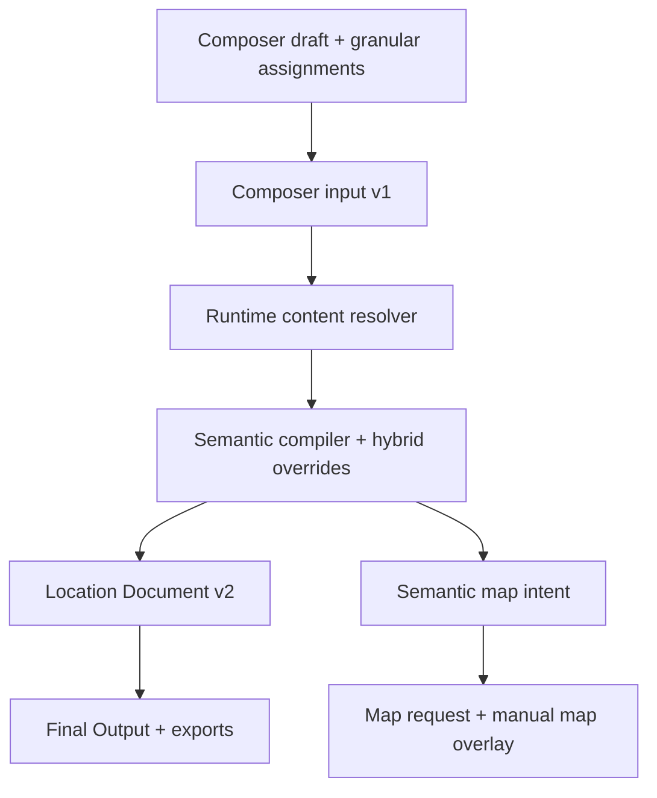

# Live integration Phase 7 — cleanup and ownership

## Outcome

The Dark Places live path has one canonical derived-document owner:
`cruor-location-document-v2`. The Composer no longer creates a legacy compile
preview or `dark-places-document-v1` as an intermediate step. Final Output and
every text/JSON export consume the semantic compiler document directly.

## Ownership

| Data | Owner | Consumers |
| --- | --- | --- |
| Composer choices, locks and assignments | Composer state | Composer input normalizer, draft persistence |
| Canonical granular pool | Static content registry | Picker selectors, runtime resolver |
| Macro semantic baseline | Semantic v2 content packs | Runtime resolver, semantic compiler |
| Compiler session structure | Composer semantic preview model | Semantic compiler only |
| Derived location content and readiness | Location Document v2 | Final Output, serializers, dashboard, map summary |
| Semantic topology | Semantic map intent | Map-request adapter |
| Manual geometry and editor changes | Map Generator manual override | Live map handoff and renderer |
| At-the-table interaction state | Session dashboard state | Dashboard only; never written into the document |

The Composer semantic preview builds its session seed directly from the current
room program and structural map request. It does not import the legacy document
writer or the v1 compatibility adapter. Granular content still resolves through
the production registry because those selectable components are an intentional
product layer, not a semantic fallback.

## Removed live/transitional paths

- legacy `getCompilePreview()` and its presentation-string builders;
- `LocationCompilePreview.jsx` and `LocationExportRoomKeyPanel.jsx`, both
  unmounted duplicate export surfaces;
- the `dark-places-document-v1` writer and its writer-only test;
- the obsolete Phase 0 v1 snapshot script and package commands;
- the generic `normalizeLocationDocumentForOutput()` v1/v2 switch;
- runtime generation of Studio modules from registry fallback data.

The export API now accepts a Location Document directly and fails closed when
the semantic compiler has not produced one. JSON, Markdown, room key, session
insert and table-ready text are projections of the same document.

## Compatibility retained intentionally

`dark-places-v1-compatibility.adapter.js` remains the single compatibility
module for imported historical fixtures and explicit v1/v2 parity checks. Its
directional functions are named at the call site:

- `adaptLocationDocumentV1ToV2()` for historical imports;
- `adaptLocationDocumentV2ToV1()` only for explicit downstream v1 compatibility;
- `createSessionStateFromLocationDocumentV1()` for migration and parity QA.

The retired legacy Dark Places content pack remains excluded from
`STATIC_CONTENT_PACKS` and is loaded only into migration-audit provenance. It is
not reactivated. The current granular picker pool comes from the canonical
production packs.

`buildInspirationModules()` remains available as an explicit migration utility,
but the static repository and Inspiration Studio now return only the canonical
module catalog. They no longer synthesize modules with
`static-content-registry-fallback` metadata.

## Removal policy

Compatibility data is removed only when its import/parity tests and downstream
v1 consumer inventory reach zero. This cleanup removes live writers and
implicit switches; it does not erase historical fixture readability or audit
evidence.

## QA boundary

Phase 7 regression coverage verifies:

- no legacy document or compile-preview dependency in the live Composer model;
- deterministic semantic compilation from the current room/map structure;
- canonical v2 export input and fail-closed missing-document behavior;
- canonical-only Studio module enumeration;
- retained explicit v1 import compatibility;
- Final Output, map handoff, granular overrides and repository-map integrity.
