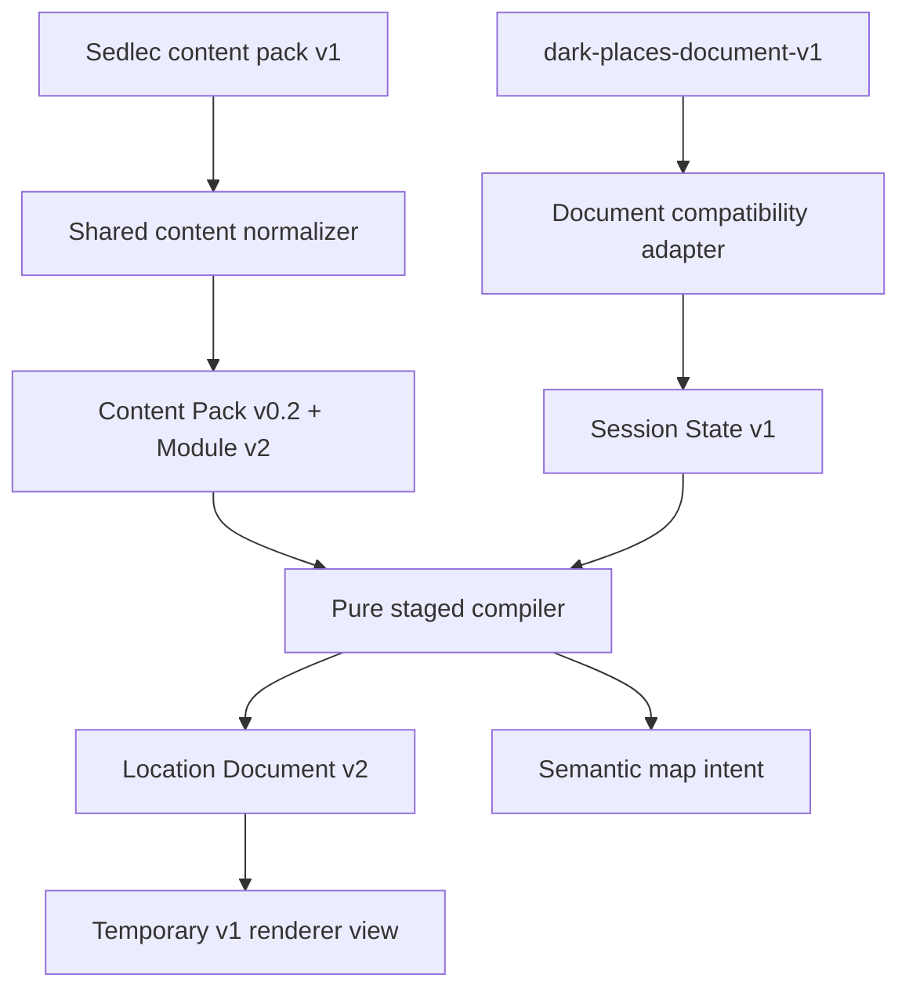

# Phase 2 — Location Document v2 and compiler skeleton

> Historical phase record. Live-integration Phase 7 supersedes the temporary
> v1 renderer and compile-preview boundaries described below. See
> [Live integration Phase 7 cleanup and ownership](./live-phase7-cleanup.md).

## Outcome

Phase 2 adds a pure deterministic compiler path without replacing the active
Composer export. The current Final Output continues to receive
`dark-places-document-v1`; it can also accept `cruor-location-document-v2`
through a temporary pure renderer view. No layout, editor, content module, or
legacy producer is removed.

The real Phase 0 Sedlec fixtures now exercise this complete compatibility path:

The document comparison reports no semantic differences across five rooms and
nine room content groups. The compatibility session selects the 11 components
present in the frozen build rather than compiling all 28 available legacy
components.

## Shared contracts

`shared/content/contracts/semantic/location-document-v2.js` owns normalization,
strict validation, canonical room/block ordering, structured validation
coverage, and provenance requirements. Renderer geometry and operational state
are forbidden from the document contract.

`shared/content/contracts/semantic/session-state-v1.js` owns the immutable
compiler session. A session identifies one module, one explicit seed, selected
component ids, and a normalized location seed. It contains no React state,
storage keys, timestamps, DOM references, network state, or random generator.

Both contracts are exported through `shared/content/content.index.js` with the
Phase 1 schemas. Shared content does not import the Dark Places feature.

## Compiler API

The public feature API is `features/darken-location/compiler/index.js`.

`compileDarkPlacesSemanticLocation({ pack, module, session })` accepts only:

- `cruor-content-pack-v0.2`;
- `cruor-inspiration-module-v2` owned by that pack;
- `cruor-session-state-v1` targeting that module.

The compiler rejects schema mismatches, dangling module ownership, a divergent
module copy, unknown selected components, and invalid canonical inputs. It does
not invoke the content v1 normalizer internally.

The Phase 2 stages are:

1. normalize and validate canonical inputs;
2. resolve selected components by semantic type;
3. build the Location Document v2 skeleton;
4. build semantic map intent and the current map-request boundary;
5. validate document structure and provenance;
6. emit a deeply frozen Location Document v2 result.

Phase 3 will replace compatibility identity/site-wide seeds with the full
authored Place Identity, atmosphere, rules, signs, and scaling behavior. Phase 2
does not fabricate those editorial structures from generic legacy text.

## Document compatibility

`dark-places-v1-compatibility.adapter.js` is limited to derived location
documents. It does not read or write content packs, modules, Inspirations, or
Studio drafts.

The historical Phase 2 boundary exposed:

- `createSessionStateFromLocationDocumentV1()` for current builds;
- `compareLocationDocumentsV1V2()` for structural and content parity;
- `adaptLocationDocumentV2ToV1()` for current renderers;
- a renderer-facing v1/v2 switch, removed after native v2 Final Output adoption.

Compatibility provenance is always `needs-revision`. Empty legacy provenance is
replaced by explicit source-aware compatibility provenance. No compatibility
path can approve editorial content.

## Map intent boundary

`dark-places-map-intent.adapter.js` creates
`cruor-dark-places-map-intent-v1` from the canonical module/session pair. The
intent contains room role, level, semantic shape, selected component ids,
connections, source metadata, and provenance. It does not contain generated
room coordinates, masks, SVG paths, pixel bounds, viewport state, or Map
Generator UI choices.

`adaptDarkPlacesMapIntentToMapRequest()` is the single Phase 2 bridge from that
semantic intent to the existing Map Generator request vocabulary. The compiler
does not import Map Generator implementation files.

## Determinism and mutation policy

- Every compiler function is synchronous and side-effect free.
- The explicit session seed is the only build seed.
- Pack modules, components, selections, rooms, map rooms, connections, and
  set-like block groups normalize to stable ordering.
- Canonical document serialization uses the Phase 1 serializer.
- No clock, global random source, DOM, storage, network, React, JSX, SVG, output
  component, Composer model, or Map Generator module is reachable from the
  compiler directory.
- Inputs are never mutated; returned contracts and compiler results are deeply
  frozen.

## Phase 2 acceptance evidence

`npm run qa:dark-places:semantic-compiler` covers:

- valid and invalid Location Document v2 and Session State contracts;
- the real Sedlec content pack v1 through the shared content normalizer;
- the real Sedlec location document v1 through the document adapter;
- five-room v2 compilation with a valid document and semantic map intent;
- v1/v2 semantic comparison with zero differences;
- repeated and independently reordered byte-identical builds;
- input immutability;
- complete document, section, room, Read-Aloud, and block provenance;
- rejection of v1 compiler inputs;
- absence of timestamps and renderer geometry;
- direct Final Output rendering of a Location Document v2 through the temporary
  compatibility view;
- compiler dependency-boundary scanning.

## Deferred work

Phase 2 intentionally does not:

- publish the editorial Sedlec module v2;
- change the active Composer export schema;
- implement Phase 3 identity, global-rule, recurring-sign, or scaling behavior;
- implement Phase 4 sensory allocation or Read-Aloud composition;
- change Studio writes;
- remove or rewrite any legacy content or document producer.
