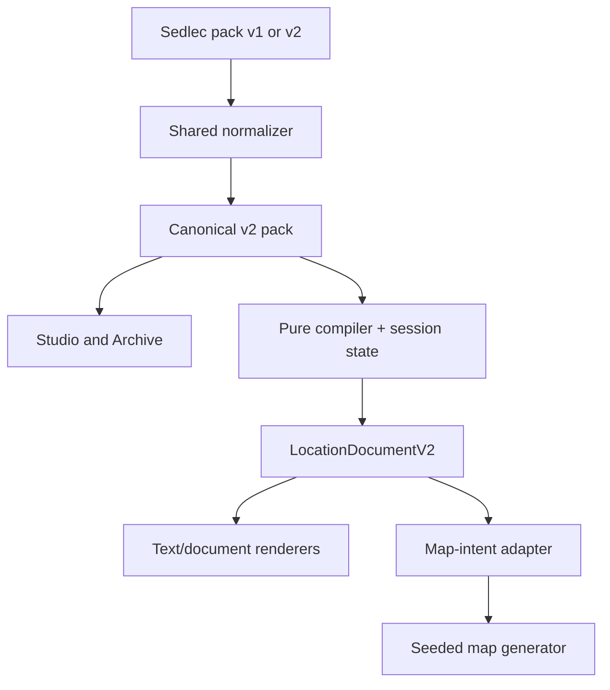

# Sedlec Ossuary v2 vertical slice

## Slice decision

Sedlec v2 supports Inspiration Archive and Dark Places. It does not declare a
Monster Crucible profile because the current module contains no monster
components. Adding placeholder monsters would enlarge scope and misrepresent the
source material.

The slice is complete only when one editorially reviewed v2 pack flows through
shared validation, compatibility reads, Studio v2-only export, pure compilation,
map intent adaptation, and every current user-facing output without a v1 write.

## Frozen Phase 0 baseline

The fixture at `tests/fixtures/dark-places-semantic-v2/sedlec-ossuary/` uses:

| Input                        | Frozen value                               |
| ---------------------------- | ------------------------------------------ |
| Base commit                  | `c02465815b68db3651a90c809d81a90b1d03189c` |
| Seed                         | `semantic-v2-sedlec-baseline-001`          |
| Title                        | `The Litany Engine`                        |
| Context                      | `Crypt`                                    |
| Horror lenses                | `Religious Horror`, `Gothic`               |
| Rooms                        | 5                                          |
| Distinct selected components | 11                                         |
| Explicit slot assignments    | 20                                         |
| Current expanded placements  | 28                                         |
| Current ready rooms          | 5 of 5                                     |

The baseline captures the current module, dedicated pack, composer snapshot,
dungeon-brief summary, compiler map request, generated-map preview, compile
preview summary, `dark-places-document-v1`, room-key Markdown, and table text.
It is a regression oracle, not the desired v2 editorial content.

## Editorial target

Sedlec must be rewritten as a coherent place model rather than a collection of
converted cards. The first approved profile contains at minimum:

- one Place Identity defining historical inspiration, fictional transformation,
  current condition, forbidden truth, and player question;
- one Site Atmosphere with a restrained material vocabulary and explicit limits
  on spectacle;
- one or more Global Rules with trigger, effect, counterplay, pressure delta, and
  at least two meaningful escalation thresholds across the profile;
- at least three Recurring Signs, each with three variations and bounded
  placement frequency;
- one Sensory Profile with pressure variants and prohibited clichés;
- arrival, threshold, and revelation Read Aloud blocks;
- one Session Guide covering funerary/religious context, safety, pacing, and exit
  signals;
- reviewed provenance for every semantic object and an explicit editorial
  decision that is not generated by conversion tooling.

Existing components may inform the draft, but their prose cannot simply be moved
field-for-field. The review must resolve duplication, distinguish factual source
context from fictional premise, make mechanics actionable, and preserve player
counterplay.

## Phase sequence — one ZIP per phase

### Phase 1 — shared contracts and compatibility read

Expected scope:

```text
shared/content/contracts/semantic/index.js
shared/content/contracts/semantic/content-pack-v0.2.js
shared/content/contracts/semantic/source-anchor-v1.js
shared/content/contracts/semantic/inspiration-v2.js
shared/content/contracts/semantic/inspiration-module-v2.js
shared/content/contracts/semantic/component-v2.js
shared/content/contracts/semantic/dark-places-capability-v2.js
shared/content/contracts/semantic/semantic-provenance-v1.js
shared/content/contracts/semantic/location-document-v2.js
shared/content/contracts/semantic/session-state-v1.js
shared/content/contracts/semantic/normalize-semantic-content.js
shared/content/contracts/semantic/*.test.js
```

Acceptance criteria:

- the contract package has zero feature/UI imports;
- v2 validation is strict and non-mutating;
- v1 Sedlec can be read into a v2 draft with stable diagnostics;
- v2 input round-trips to canonical v2 bytes;
- no serializer or Studio path writes v1;
- the Phase 0 fixture remains unchanged.

### Phase 2 — pure compiler and document v2

Expected scope:

```text
features/darken-location/compiler/dark-places-semantic-compiler.js
features/darken-location/compiler/dark-places-semantic-compiler.test.js
features/darken-location/compiler/dark-places-map-intent.adapter.js
features/darken-location/compiler/dark-places-map-intent.adapter.test.js
features/darken-location/output/model/location-document.js
features/darken-location/output/model/location-document.test.js
features/darken-location/composer/model/location-composer-output.js
features/darken-location/composer/model/location-composer-output.test.js
```

Acceptance criteria:

- the compiler accepts only canonical v2 pack/module/session inputs;
- repeated and independently ordered runs produce identical canonical bytes;
- no clock, random global, DOM, storage, network, React, SVG, or UI dependency is
  reachable from the compiler;
- map generation receives semantic map intent through one deterministic adapter;
- current renderers can consume `LocationDocumentV2`, with v1 import retained;
- document output contains no timestamp or renderer-specific geometry.

### Phase 3 — editorial Sedlec v2 content

Implementation status at Phase 3: compiler and editorial candidate complete.
Danilo subsequently approved the candidate in Phase 8 on 2026-07-16.

Expected scope:

```text
shared/content/content-packs/sedlec-ossuary-semantic-v2-pack.js
shared/content/content-packs/sedlec-ossuary-semantic-v2-pack.test.js
shared/content/static-semantic-content-packs.js
tests/fixtures/dark-places-semantic-v2/sedlec-ossuary/v2-*.json
tests/fixtures/dark-places-semantic-v2/sedlec-ossuary/v2-*.md
tests/fixtures/dark-places-semantic-v2/sedlec-ossuary/v2-*.txt
```

Acceptance criteria:

- pack and module ids agree and use the dedicated Sedlec pack;
- Archive and Dark Places profiles validate; Monster is absent;
- the source/context boundary notes are present; a person must still approve the
  editorial decision before publication;
- all semantic objects carry normalized provenance;
- a five-room build compiles with deterministic rules, recurring signs, room
  output, and map intent; the pressure-aware sensory pool is authored here and
  allocated in Phase 4, matching the main project phase boundary;
- v1 Sedlec remains readable and is not deleted or rewritten.

### Phase 4 — sensory allocation and Read-Aloud composer

Implementation status: technically complete; human editorial approval remains
open. The active Composer producer and Studio are unchanged.

Expected scope:

```text
features/darken-location/compiler/location-compiler-rng.js
features/darken-location/compiler/location-sensory.compiler.js
features/darken-location/compiler/location-read-aloud.compiler.js
features/darken-location/compiler/dark-places-semantic-compiler.js
features/darken-location/compiler/dark-places-v1-compatibility.adapter.js
scripts/content/snapshot-dark-places-semantic-v2-phase4.mjs
tests/fixtures/dark-places-semantic-v2/sedlec-ossuary/v2-phase4-*
```

The final file list must be derived from the actual diff; the glob is a planning
boundary, not permission to include all files in the ZIP.

Acceptance criteria:

- no exact repeated Immediate Impression before pool exhaustion;
- room-local changes do not rewrite unrelated sensory allocations;
- role, geometry, content, intensity, and route depth influence selection;
- compact, standard, and extended Read-Aloud variants meet authored ranges;
- hidden, GM-only, solution, and future-reveal fragments never reach player
  text;
- the current renderer/export view uses the standard variant;
- snapshots cover multiple room roles and shapes;
- existing non-migrated content remains unchanged when no semantic profiles are
  selected.

Studio v2-only writing is implemented by Phase 6. Phase 7 adds specialized
semantic editing and a compiled preview without publishing the Sedlec candidate.

### Phase 5 — Session Guide and At the Table dashboard

Implementation status: technically complete; human editorial approval remains
open. Studio, the active Composer producer, and legacy content are unchanged.

Expected scope:

```text
features/darken-location/compiler/location-session-guide.compiler.js
features/darken-location/compiler/dark-places-semantic-compiler.js
features/darken-location/compiler/dark-places-v1-compatibility.adapter.js
features/darken-location/output/components/LocationAtTheTableDashboard.jsx
features/darken-location/output/model/location-session-dashboard-state.js
features/darken-location/output/LocationOutputWorkspace.jsx
scripts/content/snapshot-dark-places-semantic-v2-phase5.mjs
tests/fixtures/dark-places-semantic-v2/sedlec-ossuary/v2-phase5-*
```

The final file list is derived from the actual diff; this planning boundary does
not authorize unrelated files in the ZIP.

Acceptance criteria:

- opening beat identifies the entrance and gives an immediate decision;
- objectives, rule references, Litany track, clue flow, stall moves, and room
  shortcuts are actionable rather than administrative counts;
- every required revelation has stable room evidence and valid links;
- Litany interaction is bounded and thresholds update visibly;
- clue discovery and pressure values remain outside the generated document;
- optional persistence is scoped by build id and document version;
- room shortcuts open existing room sections;
- native keyboard controls and accessibility labels are tested;
- reset never changes the authored module or generated build;
- legacy v1 At the Table blocks remain readable.

Studio v2-only writing is complete in Phase 6. No approval, registry adoption, full
Inspiration migration, or legacy deletion is included in Phase 5.

### Phase 7 — Specialized Studio authoring and preview

Implementation status: technically complete; human editorial approval remains
open. Sedlec can be imported, edited through normal semantic controls, exported
as canonical v2, and compiled in Studio with explicit seed, context, intrusion,
room-count, and room-role controls. Equal inputs produce the same preview
fingerprint. Health, Coverage, Readiness, and Warnings expose remaining semantic
and editorial gaps with exact field links.

Acceptance criteria:

- every Sedlec semantic type resolves to a specialized editor;
- Global Rule mechanics and counterplay checks are authorable without raw JSON;
- preview invokes the canonical pure compiler and exposes diagnostics and
  provenance;
- semantic sample QA proves repeatability across multiple contexts and room
  roles;
- Studio continues to write only v2;
- no publication, active-registry adoption, mechanical approval, or legacy
  deletion occurs.

### Phase 8 batch 1 — canonical catalog integration and editorial candidate QA

Implementation status: complete and editorially approved by Danilo on
2026-07-16. `CRUOR_INSPIRATION_MODULES` selects the Sedlec v2 module for Studio and
module-repository consumers. The public v0.1 registry remains unchanged during
the staged migration and continues to expose the current Archive records and
Sedlec component links.

Acceptance evidence:

- all 14 Inspirations have explicit migration records and no registry fallback
  module was found;
- Sedlec is canonical v2 with editorial provenance and zero legacy warnings;
- all seven required Studio semantic types are covered;
- publication minimums are met for identity, atmosphere, rule, signs, sensory,
  Read-Aloud, and Session Guide content;
- Crypt, Chapel, and Archive samples compile twice to equal bytes, cover five to
  seven rooms, and report zero diagnostics;
- human approval cannot be inferred from technical readiness;
- no legacy file is deleted and no v1 write path is introduced.

The detailed decision record is
`phase8-batch1-sedlec-editorial-review.md`. Decomposition now occupies the next
separate ZIP as a technically complete candidate and still requires its own
human sign-off.

## End-to-end data flow



The normalizer is the only dual-read boundary. Studio points back to canonical v2
on export; there is no arrow from any v2 object to a v1 serializer.

## Determinism protocol

1. Canonicalize pack, module id, and session input.
2. Hash `schemaVersion`, content version, module id, and `session.seed` to derive
   the local PRNG seed.
3. Preserve authored order only where the contract says order is semantic;
   otherwise sort by stable id.
4. Resolve rules and pressure without mutation.
5. Place recurring signs with stable id tie-breaking.
6. Emit semantic regions and map intent.
7. Canonically serialize and calculate SHA-256.
8. Compile twice in isolated calls and fail QA on any byte difference.

## Regression and QA gates

Every phase runs the full command set in the project README plus targeted tests
for every changed contract/compiler/Studio consumer. Sedlec-specific assertions
must cover:

- pack/module ownership;
- Archive + Dark Places capability and absent Monster capability;
- five-room deterministic compilation;
- global-rule pressure thresholds and counterplay;
- recurring-sign occurrence bounds and stable placements;
- provenance completeness;
- v1 dual-read and v2-only serialization;
- equality of two compiler runs and checked-in fixture hashes;
- text, document, and map-intent output;
- unchanged behavior for at least one non-migrated Inspiration.

Each ZIP contains only the files changed by that phase. Its patch manifest names
the base commit, every path and SHA-256, executed test results, and exact QA
commands. Legacy deletion remains a separate final ZIP after all 14 migrations.
