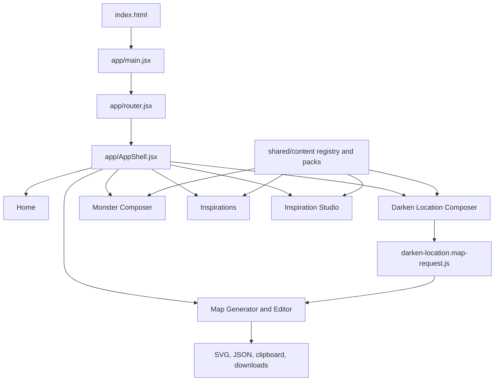

# Architecture

Cruor Games is a Vite React application. `index.html` loads `/app/main.jsx`; `app/main.jsx` imports global styles, starts tooltip and accessibility side effects, and renders `AppRouter` from `app/router.jsx`.

The app does not use React Router. `app/router.jsx` owns route parsing, history mutation, top-level route state, UI mode state, active generator selection, Darken view state, and the bridge that opens the map generator from a Darken location build. `app/AppShell.jsx` renders the active workspace inside the global topbar and owns accessibility settings loaded through `shared/accessibility/accessibility.settings.js`.

## Boundaries

- `app/` coordinates global application state and route selection.
- `features/<feature-name>/` contains feature-specific UI, models, data, and QA helpers.
- `shared/content/` is the canonical shared content architecture: schemas, static packs, registry construction, repository adapters, source anchors, and inspiration module factories.
- `shared/accessibility/`, `shared/i18n/`, `shared/styles/`, and `shared/tooltips/` are cross-feature infrastructure.
- `scripts/` owns Node utilities, content export and validation, map QA, Monster QA, repository-map generation, and diagnostics.
- `public/` contains static media available to the Vite build and browser.

## Content Architecture

The current shared content path starts with content-pack schemas and static packs, then builds `STATIC_CONTENT_REGISTRY` in `shared/content/static-registry.js`. `shared/content/registry.js` normalizes workflows, slots, components, source anchors, inspirations, and taxonomies into queryable collections. `shared/content/content-repository.adapter.js` exposes repository-style access and bridges registry data into inspiration modules. Shared room metadata contracts live under `shared/content/contracts/`; `room-shapes.js` is the canonical semantic shape and capability registry, while `room-constraint-resolver.js` converts authored and legacy room contributions into deterministic compatibility reports without depending on React, SVG, or generator geometry. `shared/content/contracts/semantic/` owns the additive semantic v2 content, Location Document, and compiler Session State contracts. `static-semantic-content-packs.js` keeps v2 editorial candidates separate from the active v0.1 registry. Darken's staged compiler imports those contracts and emits renderer-independent identity, scaled site-wide systems, room sign allocations, exact-unique sensory impressions, spoiler-filtered Read-Aloud variants, an operational Session Guide and clue graph, document, and map-intent data without creating a reverse feature dependency. The output feature owns separate mutable At the Table state scoped by build id and document version; it never writes into compiled or authored content. Darken Composer, Dungeon Brief, and Map Generator continue consuming the existing production contracts during the staged migration.

Phase 6 moves Inspiration Studio's authoring boundary onto those shared semantic
contracts. Studio reads canonical v2 packs/modules and transitional v1 modules,
uses a feature-local editor registry keyed by `semanticType`, and emits only
canonical Content Pack v0.2 or Inspiration Module v2 JSON. The mutable editor
projection preserves existing Monster graft workflows, but legacy-shaped fields
are translated into `semantic` and `generation` once and never serialized
alongside v2. The production registry and active Composer remain unchanged.

Phase 7 activates the semantic editor ids through a schema-driven, feature-local
registry and specialized form components. Studio preview passes canonical v2
content to the pure Dark Places compiler; Health, Coverage, Readiness, and
Warnings consume dependency-free model reports with exact field paths. Shared
contracts still have no React, SVG, Map Generator UI, browser, or compiler
dependency.

Phase 8 uses a per-module migration boundary. The shared module catalog uses the
authored Sedlec, Decomposition, and The Mist v2 modules while the active v0.1
static registry and all legacy files remain available; the other 11 catalog
modules still use legacy v1. A separate migration registry tracks every module's
schema, coverage, sample QA, reviewer, review date, and blockers without
polluting published semantics. The Mist adds a fair-navigation invariant:
perception may drift, but authored topology remains stable, discrepancies are
player-facing, and final breaches retain an anchored retreat. Node scripts audit
and validate this state and invoke the same pure compiler used by Studio preview.

Monster Composer still also has native graft data in `features/monster-composer/data/monster-grafts.js`; `features/monster-composer/data/monster-content-pack-feed.js` adapts shared registry components into Monster Composer concepts. This is a confirmed transitional model overlap.

## Generator And Rendering Architecture

The map subsystem separates data generation from visual rendering:

- `features/darken-location/map-generator/map-generator.input.js` normalizes input.
- `features/darken-location/map-generator/map-generator.pipeline.js` orchestrates `generateMap`.
- Graph, layout, masks, corridors, details, and geometry are split into sibling modules.
- `features/darken-location/map-generator/map-generator.render.jsx` renders the generated model as SVG.
- `features/darken-location/map-generator/map-generator.page.jsx` owns the editor UI, manual overrides, clipboard/download behavior, browser listeners, view state, and embedded composer behavior.

## Testing And Deployment

CI is defined in `.github/workflows/ci.yml` and runs on pushes to `main`, pull requests targeting `main`, and manual dispatch. The blocking architecture job validates the repository-map fingerprint, map freshness, shared content registry, and Recovery A–D semantic ownership. The blocking quality job runs lint, Monster QA, Vitest, and the production build. Browser tests run separately as a visible non-blocking job until Recovery F closes the existing browser and regression backlog. GitHub Pages deployment remains defined in `.github/workflows/deploy-pages.yml`, which builds Vite output and copies `dist/index.html` to `dist/404.html`.

## Consolidated Findings

- High-risk central modules: `app/router.jsx`, `features/darken-location/map-generator/map-generator.page.jsx`, `features/darken-location/composer/DarkenLocationComposerPage.jsx`, `features/monster-composer/monster-composer.page.jsx`, and `features/inspiration-studio/InspirationStudioPage.jsx`.
- No static circular import cycles were detected in the generated repository map baseline.
- Several critical browser-side behaviors are only partially covered by automated checks, especially map editor pointer/keyboard interaction and popout export behavior.
- Existing older documentation and report files are contextual reference only; the code and generated repository map are the current architecture source of truth.
- Legacy duplicate tests under `tests/tests/` and `tests/tests/tests/` have unresolved imports and are excluded by current Vitest configuration.
