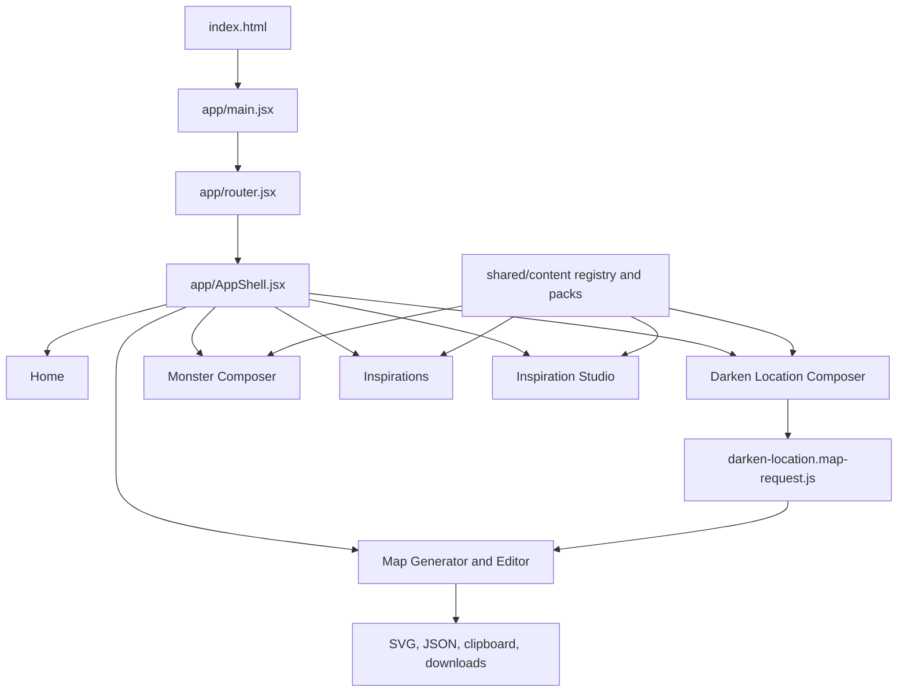

# Architecture

Cruor Games is a Vite React application. `index.html` loads `/app/main.jsx`; `app/main.jsx` imports global styles, starts tooltip and accessibility side effects, and renders `AppRouter` from `app/router.jsx`.

The app does not use React Router. `app/router.jsx` owns route parsing, history mutation, top-level route state, UI mode state, active generator selection, Darken view state, and the bridge that opens the map generator from a Darken location build. `app/AppShell.jsx` renders the active workspace inside the global topbar and owns accessibility settings loaded through `shared/accessibility/accessibility.settings.js`.

## Boundaries

- `app/` coordinates global application state and route selection.
- `features/<feature-name>/` contains feature-specific UI, models, data, and QA helpers.
- `shared/content/` is the canonical shared content architecture: schemas, static packs, registry construction, repository adapters, source anchors, and inspiration module factories.
- `shared/accessibility/`, `shared/i18n/`, `shared/styles/`, and `shared/tooltips/` are cross-feature infrastructure.
- `scripts/` owns Node utilities, content export and validation, map QA, Monster QA, repository-map generation, and diagnostics.
- `public/` contains static media available to the Vite build and browser.

## Content Architecture

The current shared content path starts with content-pack schemas and static packs, then builds `STATIC_CONTENT_REGISTRY` in `shared/content/static-registry.js`. `shared/content/registry.js` normalizes workflows, slots, components, source anchors, inspirations, and taxonomies into queryable collections. `shared/content/content-repository.adapter.js` exposes repository-style access and bridges registry data into inspiration modules.

Monster Composer still also has native graft data in `features/monster-composer/data/monster-grafts.js`; `features/monster-composer/data/monster-content-pack-feed.js` adapts shared registry components into Monster Composer concepts. This is a confirmed transitional model overlap.

## Generator And Rendering Architecture

The map subsystem separates data generation from visual rendering:

- `features/darken-location/map-generator/map-generator.input.js` normalizes input.
- `features/darken-location/map-generator/map-generator.pipeline.js` orchestrates `generateMap`.
- Graph, layout, masks, corridors, details, and geometry are split into sibling modules.
- `features/darken-location/map-generator/map-generator.render.jsx` renders the generated model as SVG.
- `features/darken-location/map-generator/map-generator.page.jsx` owns the editor UI, manual overrides, clipboard/download behavior, browser listeners, view state, and embedded composer behavior.

## Testing And Deployment

CI is defined in `.github/workflows/ci.yml`: install with `npm ci`, install Playwright Chromium, run build, Vitest, and Playwright. GitHub Pages deployment is defined in `.github/workflows/deploy-pages.yml`, which builds Vite output and copies `dist/index.html` to `dist/404.html`.

## Consolidated Findings

- High-risk central modules: `app/router.jsx`, `features/darken-location/map-generator/map-generator.page.jsx`, `features/darken-location/composer/DarkenLocationComposerPage.jsx`, `features/monster-composer/monster-composer.page.jsx`, and `features/inspiration-studio/InspirationStudioPage.jsx`.
- No static circular import cycles were detected in the generated repository map baseline.
- Several critical browser-side behaviors are only partially covered by automated checks, especially map editor pointer/keyboard interaction and popout export behavior.
- Existing older documentation and report files are contextual reference only; the code and generated repository map are the current architecture source of truth.
- Legacy duplicate tests under `tests/tests/` and `tests/tests/tests/` have unresolved imports and are excluded by current Vitest configuration.

