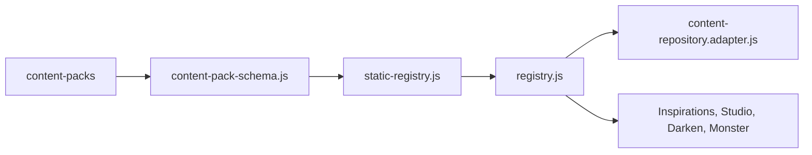

# Shared Content

## Scope

Shared content lives under `shared/content/` and includes content-pack schemas, static registry construction, content repository adapters, source anchors, taxonomies, inspirations, and inspiration modules.

## Canonical Path

## Responsibilities

- Define the canonical content-pack shape.
- Own shared room archetype, room design, compatibility, and capability contracts under `shared/content/contracts/`.
- Normalize static packs into stable registries.
- Track provenance and issues.
- Expose lookup/filter APIs.
- Bridge registry data into feature-facing repository or module shapes.

## Room Contracts

`shared/content/contracts/room-archetypes.js` owns the canonical room archetype definitions and aliases. `room-design.js` owns the authored room-design schema, normalization, archetype compilation, and legacy merge behavior. `room-shapes.js` owns the canonical semantic shape registry, support status, minimum dimensions, editor labels, geometry families, and shape-specific modifier capability matrix. `room-compatibility.js` and `room-capabilities.js` define the normalized compatibility and engine-capability vocabulary.

`room-constraint-resolver.js` compiles base regions, templates, archetypes, assigned components, candidate components, and manual overrides into order-independent atomic constraints. It resolves hard intersections, soft scoring, compatibility policies, engine support, field-level provenance, changes, warnings, and structured conflicts without importing React, SVG, or generator geometry. The resolver is exported through `shared/content/content.index.js` and is used by the Darken Dungeon Brief handoff, Component Picker, manual room-style validation, and atomic assignment transactions. Shape capability validation now rejects unsupported shape/modifier combinations before commit rather than allowing a metadata-only result.

`shared/content/contracts/location-component-effect.js` defines the umbrella `location-component-effect-v0.1` contract. It classifies output, placement, topology, and renderer intent while lifting the existing `mapInfluence`, `roomDesign`, and `roomCompatibility` contracts with provenance and diagnostics. Components without procedural metadata normalize explicitly to `output-only`; text fields never become topology flags through truthiness.

`shared/content/adapters/darken-components.js` preserves `mapInfluence`, `roomDesign`, `roomCompatibility`, and authored effect metadata when legacy Darken components are converted into shared components. The adapter attaches the normalized effect contract so content origin does not change handoff semantics.

Map Generator keeps compatibility wrappers at `map-generator.profile.js` and `map-generator.room-design.js`; the latter exposes engine support from the shared shape registry without collapsing semantic shapes. Feature-agnostic consumers such as Inspiration Studio import shared contracts rather than generator implementation files.

## Tests

`npm run content:validate` is the primary targeted check. `shared/content/contracts/room-contracts.test.js` protects compatibility exports and legacy normalization. `room-constraint-resolver.test.js` covers deterministic resolution, conflict classes, manual override precedence, capabilities, provenance, and input immutability. The Dungeon Brief handoff test verifies that adapter output reaches the resolver and Map Generator without losing room metadata. `room-constraint-evaluation.test.js` covers candidate attribution, transformations, explicit replacement, manual override blocking, and order independence; the picker rendering test verifies disabled reasons and transform previews. Build and feature QA provide indirect coverage.

## Findings

- Confirmed: shared content registry is central and high fan-in.
- Confirmed: adapters are transitional boundaries and should be changed carefully.
- Risk: high for schema/normalization changes because multiple features consume the output.
