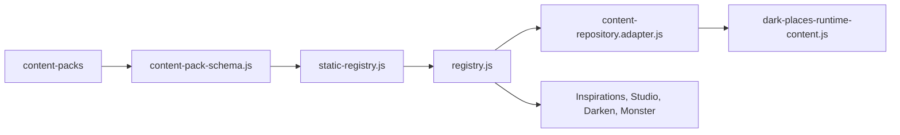

# Shared Content

## Scope

Shared content lives under `shared/content/` and includes content-pack schemas, static registry construction, content repository adapters, source anchors, taxonomies, inspirations, and inspiration modules.

## Canonical Path

## Responsibilities

- Define the canonical content-pack shape.
- Own shared room archetype, room design, compatibility, and capability contracts under `shared/content/contracts/`.
- Own the dependency-free semantic v2 schema, validation, canonicalization, and v1 read compatibility boundary under `shared/content/contracts/semantic/`.
- Normalize static packs into stable registries.
- Track provenance and issues.
- Expose lookup/filter APIs.
- Bridge registry data into feature-facing repository or module shapes.
- Resolve version-pinned Dark Places runtime content without creating a second registry.

## Room Contracts

`shared/content/contracts/room-archetypes.js` owns the canonical room archetype definitions and aliases. `room-design.js` owns the authored room-design schema, normalization, archetype compilation, and legacy merge behavior. `room-shapes.js` owns the canonical semantic shape registry, support status, minimum dimensions, editor labels, geometry families, and shape-specific modifier capability matrix. `room-compatibility.js` and `room-capabilities.js` define the normalized compatibility and engine-capability vocabulary.

`room-constraint-resolver.js` compiles base regions, templates, archetypes, assigned components, candidate components, and manual overrides into order-independent atomic constraints. It resolves hard intersections, soft scoring, compatibility policies, engine support, field-level provenance, changes, warnings, and structured conflicts without importing React, SVG, or generator geometry. The resolver is exported through `shared/content/content.index.js` and is used by the Darken Dungeon Brief handoff, Component Picker, manual room-style validation, and atomic assignment transactions. Shape capability validation now rejects unsupported shape/modifier combinations before commit rather than allowing a metadata-only result.

`shared/content/contracts/location-component-effect.js` defines the umbrella `location-component-effect-v0.1` contract. It classifies output, placement, topology, and renderer intent while lifting the existing `mapInfluence`, `roomDesign`, and `roomCompatibility` contracts with provenance and diagnostics. Components without procedural metadata normalize explicitly to `output-only`; text fields never become topology flags through truthiness.

`shared/content/adapters/darken-components.js` preserves `mapInfluence`, `roomDesign`, `roomCompatibility`, and authored effect metadata when legacy Darken components are converted into shared components. The adapter attaches the normalized effect contract so content origin does not change handoff semantics.

Map Generator keeps compatibility wrappers at `map-generator.profile.js` and `map-generator.room-design.js`; the latter exposes engine support from the shared shape registry without collapsing semantic shapes. Feature-agnostic consumers such as Inspiration Studio import shared contracts rather than generator implementation files.

## Semantic Content Contracts

`shared/content/contracts/semantic/` is the Phase 1 schema authority shared by runtime features and Inspiration/Component Studio. It owns Content Pack v0.2, Source Anchor v1, Inspiration v2, Inspiration Module v2, Component v2, provenance, mechanical scaling, and the specialized place, atmosphere, global rule, recurring sign, sensory, read-aloud, and session-guide models. The public surface is re-exported by `shared/content/content.index.js`; consumers do not import a feature implementation to obtain these contracts.

`normalizeSemanticContent()` is the single dual-read boundary. It accepts canonical v2 data and supported v1 pack/module/component/Inspiration shapes, but emits only canonical v2 objects. Compatibility output is always draft and marked `needs-revision`; it cannot be approved or published mechanically. No v1 serializer or dual-write path exists. Canonical serialization recursively sorts object keys while preserving authored array order, so equal inputs produce byte-identical output without clocks, random values, browser state, or network access.

Phase 2 adds `location-document-v2.js` and `session-state-v1.js` to the same package. Location Document v2 owns renderer-independent identity, site-wide systems, session guidance, semantic map topology, rooms, validation coverage, and provenance. Session State v1 is the immutable compiler input for one module/build. Neither contract stores timestamps, SVG or pixel geometry, browser state, or feature objects.

Phase 3 adds `content-packs/sedlec-ossuary-semantic-v2-pack.js` as the first editorial v2 candidate and exposes it through `static-semantic-content-packs.js`. This list is intentionally separate from the active v0.1 static registry so schema families are not mixed. The module declares Archive and Dark Places but not Monster and carries normalized editorial provenance. Danilo approved it in Phase 8 on 2026-07-16.

Phase 4 enriches the Sedlec Read-Aloud fragments with stable ids and compatibility metadata for room roles, semantic geometry, visible features, intensity, and spoiler classification. Sensory and Read-Aloud contracts remain unchanged and dependency-free; allocation and prose composition are derived by the feature compiler rather than written back into shared authored content.

Phase 5 consumes the existing dependency-free Session Guide contract without changing the authored pack or shared schema version. The feature compiler derives clue nodes, room evidence, pressure dashboard metadata, and shortcuts into Location Document v2. Mutable At the Table values live in the output feature rather than shared authored content or compiler Session State.

Phase 6 adopts the shared normalizer and canonical serializer at the Inspiration
Studio boundary. Studio's compatibility reader can open v1 modules, but its
writer emits only Content Pack v0.2 and Inspiration Module v2. The shared
contracts remain UI-independent; Studio-specific Monster preservation and editor
projection stay inside the feature.

Phase 7 consumes those normalizers and validators through Studio's feature-local
semantic editor registry. Specialized React editors, preview controls, coverage,
and warning links remain outside `shared/content/`; the contracts gain no UI or
compiler dependency.

Phase 8 batch 1 adds the dependency-free migration registry under
`shared/content/migrations/` and selects the canonical Sedlec v2 module in
`CRUOR_INSPIRATION_MODULES`. The tracking data is separate from published
semantics and cannot infer human approval. At the batch-1 boundary the remaining
13 catalog entries were classified legacy v1; no registry fallback module was
active. Sedlec's explicit
reviewer, date, and approval are recorded after the human decision.

The active v0.1 static registry remains unchanged. Legacy Sedlec exports and
all conversion paths remain available for dual-read and regression coverage;
no legacy producer or consumer is removed in this batch.

Phase 8 batch 2 selects the canonical Decomposition v2 module for Studio and
module-repository consumers. Its canonical source owns 10 editorial Dark Places
components and 26 explicit Monster graft components. Danilo approved revision 2
on 2026-07-17 after sample QA passed; image provenance remains a separate
publication blocker. The active v0.1 static registry still owns the public
Archive and its 53 Decomposition component links; the legacy module and pack
remain present for dual-read and regression checks.

Phase 8 batch 3 selects the canonical The Mist v2 module for Studio and
module-repository consumers. Its canonical source owns 10 editorial semantic
Dark Places components that account exactly once for all 24 legacy location and
region ids. Danilo approved candidate 1 and its transformative-use boundary on
2026-07-17 after sample QA passed; image provenance remains a separate
publication blocker. `static-semantic-content-packs.js` lists the pack separately
from the active v0.1 registry. The legacy module remains available for dual-read,
component-parity, and public-registry regression checks.

## Dark Places Runtime Content Boundary

`contracts/dark-places-composer-input.js` defines the immutable
`cruor-dark-places-composer-input-v1` handoff. It version-pins the selected
semantic module pack and preserves normalized Source Anchors, context, horror,
intrusion, seed, rooms, map state, granular selections, slot assignments, locks,
user overrides, and caller provenance. Assignment clocks are deliberately not
part of the contract.

`contracts/dark-places-hybrid-override.js` owns the versioned live Phase 4
directive grammar. It defines the seven allowed strategies, the map/region scope
split, deterministic directive ids, target component/block ids, normalization,
and structured validation. Canonical slot assignments always carry an explicit
strategy and scope; transient assignment clocks remain excluded.

`dark-places-runtime-content.js` is the only composite resolver for that input.
The static Content Repository exposes it as `resolveDarkPlacesRuntimeContent()`.
It reads the separate semantic v2 pack catalog for the macro baseline and the
production registry for granular location components and regions, then returns
stable id-sorted pools, resolved selection references, provenance, and structured
diagnostics. Phase 4 also emits a deterministic `hybridOverridePlan` with
separate `mapScoped` and `regionScoped` collections. Existing Composer locks are
promoted to explicit `lock` directives, and legacy ids declared by the semantic
module become target component ids without copying granular data into that
module. Modern Monster capabilities remain external ownership links from
pack metadata; the resolver never imports or copies Monster graft data. This
boundary is pure and renderer-independent. Phase 3 adds a version-pinned module
reference lookup on the same repository so the live Composer never imports the
semantic pack catalog directly.

## Tests

`npm run content:validate` is the primary legacy registry check. `npm run qa:dark-places:semantic-contracts` covers semantic v2 valid, invalid, edge, compatibility, immutability, canonicalization, and dependency-boundary behavior against the real Sedlec v1 fixtures. `npm run qa:dark-places:semantic-compiler` adds Location Document/Session State contract and compiler coverage; `npm run qa:dark-places:semantic-phase3` validates the editorial pack, deterministic v2 fixtures, scaling, placement, output separation, and v1 preservation; `npm run qa:dark-places:semantic-phase4` validates profile consumption, sensory uniqueness, Read-Aloud composition, spoiler filtering, and standard output projection; `npm run qa:dark-places:semantic-phase5` validates Session Guide derivation, clue availability, pressure metadata, dashboard state, accessibility, and persistence isolation; `npm run qa:dark-places:semantic-phase6` validates Studio v1 import, v2-only canonical round trips, editor registry coverage, and Monster graft preservation. `shared/content/contracts/room-contracts.test.js` protects compatibility exports and legacy normalization. `room-constraint-resolver.test.js` covers deterministic resolution, conflict classes, manual override precedence, capabilities, provenance, and input immutability. The Dungeon Brief handoff test verifies that adapter output reaches the resolver and Map Generator without losing room metadata. `room-constraint-evaluation.test.js` covers candidate attribution, transformations, explicit replacement, manual override blocking, and order independence; the picker rendering test verifies disabled reasons and transform previews. Build and feature QA provide indirect coverage.

Phase 7 adds `npm run qa:dark-places:semantic-phase7` for specialized semantic
authoring, coverage, field links, compiler preview determinism, sample QA, and
Health reporting.

Phase 8 adds catalog audit, canonical candidate validation, Studio coverage,
warning-free semantic sample QA, and migration-state tests through
`npm run qa:dark-places:semantic-phase8`.

Final live Phase 8 completes the production granular pool for Impalement with
one canonical clue and one canonical encounter twist. The semantic baseline and
production granular registry remain separate owners, while migration provenance
accounts for both ids exactly once. `npm run qa:dark-places:phase8-final`
combines all 14 editorial checks, live Composer/compiler/output QA, and static
content validation.

`shared/content/dark-places-runtime-content.test.js` covers canonical input
normalization, all 14 migrated modules, exact Sedlec production pools, registry
and pack iteration-order independence, deep immutability, version drift,
selection diagnostics, typed hybrid plans, scope separation, lock promotion,
module-reference resolution, provenance, and the external
Monster ownership boundary.

## Findings

- Confirmed: shared content registry is central and high fan-in.
- Confirmed: semantic v2 contracts are additive in Phase 1 and do not alter the active legacy registry or feature runtime.
- Confirmed: compatibility normalization is read-only and cannot produce approved editorial content.
- Confirmed: Sedlec is the first approved canonical v2 module in the shared
  module catalog; the active legacy registry is still preserved.
- Confirmed: Decomposition is the second approved canonical module and first
  complete A + D + M migration; image provenance remains a publication blocker.
- Confirmed: The Mist is the third approved canonical module and a complete A + D
  migration; its stable-topology and transformative-use review passed, while
  image provenance remains a publication blocker.
- Confirmed: adapters are transitional boundaries and should be changed carefully.
- Risk: high for schema/normalization changes because multiple features consume the output.
