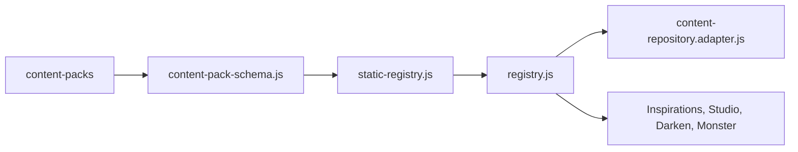

# Shared Content

## Scope

Shared content lives under `shared/content/` and includes content-pack schemas, static registry construction, content repository adapters, source anchors, taxonomies, inspirations, and inspiration modules.

## Canonical Path

## Responsibilities

- Define the canonical content-pack shape.
- Normalize static packs into stable registries.
- Track provenance and issues.
- Expose lookup/filter APIs.
- Bridge registry data into feature-facing repository or module shapes.

## Tests

`npm run content:validate` is the primary targeted check. Build and feature QA provide indirect coverage.

## Findings

- Confirmed: shared content registry is central and high fan-in.
- Confirmed: adapters are transitional boundaries and should be changed carefully.
- Risk: high for schema/normalization changes because multiple features consume the output.

