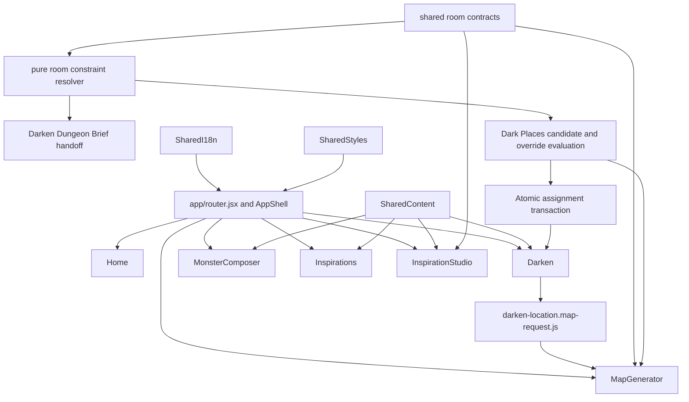
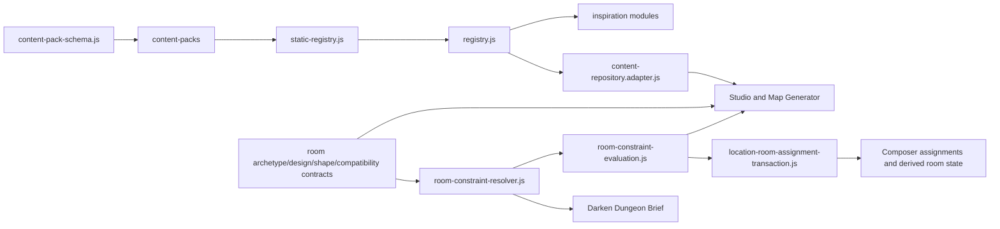
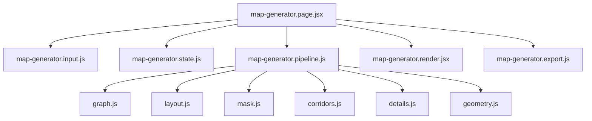
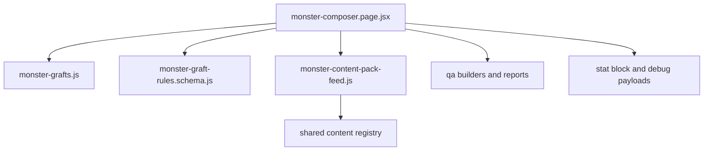

# Dependency Graph

The exhaustive import graph is generated in [repository-map.json](repository-map.json). This document summarizes the graph by subsystem.

## Feature Level

## Shared Content

## Map Generator

## Monster Composer

## Central Modules

High fan-in baseline from the generated graph includes:

- `features/darken-location/map-generator/map-generator.input.js`
- `features/inspiration-studio/components/StudioIcon.jsx`
- `features/monster-composer/data/monster-content-pack-feed.js`
- `features/monster-composer/model/monster-graft-rules.schema.js`
- `shared/content/content-pack-schema.js`
- `shared/content/inspiration-modules/inspiration-module.factory.js`

High fan-out baseline includes:

- `features/inspiration-studio/InspirationStudioPage.jsx`
- `shared/content/content.index.js`
- `features/monster-composer/monster-composer.page.jsx`
- `shared/content/inspiration-modules.js`
- `features/darken-location/composer/DarkenLocationComposerPage.jsx`
- `features/darken-location/map-generator/map-generator.page.jsx`

## Cycles And Boundary Notes

No static circular dependency candidates were detected in the generated baseline. Cross-feature imports are mainly intentional through app routing, shared content adapters, and the Darken-to-map bridge. Room metadata now crosses Studio, Dungeon Brief, and Map Generator through `shared/content/contracts/`, while the former generator modules remain compatibility wrappers. The pure constraint resolver is invoked by the feature-local `dungeon-room-constraints.js` boundary; Composer candidate evaluation and Map Generator manual-override validation pass through `room-constraint-evaluation.js`. Region assignment commits pass through `composer/model/location-room-assignment-transaction.js`, while `location-room-constraint-state.js` owns signatures, sanitation, and atomic history snapshots. New cross-feature imports should prefer `shared/` contracts or explicit bridge modules.
