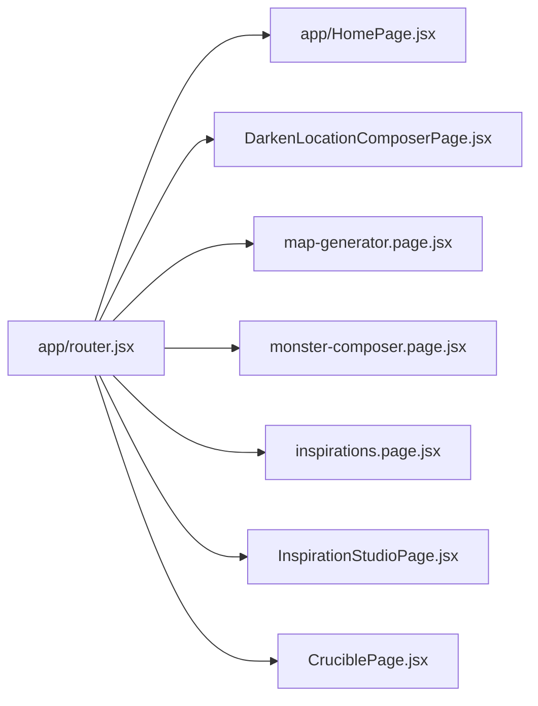

# Routes And Navigation

Routing is custom and centralized in `app/router.jsx`. There is no React Router dependency in the current app.

## Public Routes

- `/`: Home.
- `/darkplaces`: Darken a Location composer.
- `/darkplaces/map`: Map Generator route.
- `/terrifyingmonsters`: Monster Composer.
- `/inspirations`: Inspirations archive.
- `/inspiration-studio`: Inspiration Studio.

## Query Parameters And Compatibility Entrypoints

`app/router.jsx` also supports query-driven compatibility modes and deep links:

- `studio=1` or `admin=studio`: opens Inspiration Studio.
- `section=inspirations`: opens Inspirations.
- `section=crucible`: opens Crucible.
- `tool`, `generator`, `view`, and `darkenView`: select internal Crucible or Darken views.
- `cruorTest=dark-places` or `testHarness=dark-places`: Dark Places test harness behavior.

These are route selection inputs, not separate page files.

## Internal Navigation State

The router owns:

- active section.
- active UI mode.
- active locale.
- active Crucible generator.
- active Darken tab.
- whether the map generator has been opened.
- current map request and revision.
- Monster Composer inspiration seed.
- Darken snapshot provider ref.

Navigation mutates browser history with `window.history.pushState` and `window.history.replaceState`, listens for `popstate`, and may use `window.confirm` to protect unsaved transitions. Not all internal UI state is URL-backed; feature-local panel, filter, selection, and editor states remain inside feature pages.

## Route To Page Mapping

## Localized Navigation Copy

`app/navigation/site-navigation.data.js` contains only navigation structure and technical metadata. All user-facing Crucible menu copy, including labels, descriptions, catchphrases, feature lists, preview text, image alternatives, and menu ARIA labels, is resolved from `shared/i18n/locales/en.js` and `shared/i18n/locales/it.js` through `getSiteNavItems(locale)`.

## Navigation Risk

`app/router.jsx` is critical risk: it owns browser URL state, app-level state, cross-feature callbacks, and recovery prompts. Changes should be tested with direct route loads and browser back/forward behavior.

## Internal Link Contract

Site-level destinations are rendered through `app/navigation/SiteLink.jsx` as real `<a href>` elements. The component intercepts only an unmodified primary-button click and delegates that navigation to the custom router. Modified clicks, middle clicks, context-menu actions, copied addresses, and explicit new-tab navigation retain native browser behavior.

Major navigation surfaces using this contract include:

- the topbar logo;
- Home and Inspirations in desktop and mobile navigation;
- Dark Places and Terrifying Monsters in the Crucible mega menu;
- generator and Inspirations calls to action on the homepage.

Menu triggers, settings, tabs, modal controls, and other actions without a standalone URL remain buttons.

## Site-Wide Page Transitions

`app/site-page-transition.js` is the centralized transition runtime. `app/router.jsx` invokes it from `navigateToRoute` and from the `popstate` handler, so every route registered through the existing router receives the same page transition automatically.

The runtime:

- uses the browser View Transitions API when available;
- falls back to a CSS entry animation on `.app-shell__workspace`;
- leaves the persistent site topbar outside the animated workspace;
- respects the Cruor motion preference and the operating-system `prefers-reduced-motion` setting.

New public pages do not need page-specific animation code. They only need a route mapping and navigation metadata that uses the normal router path.
