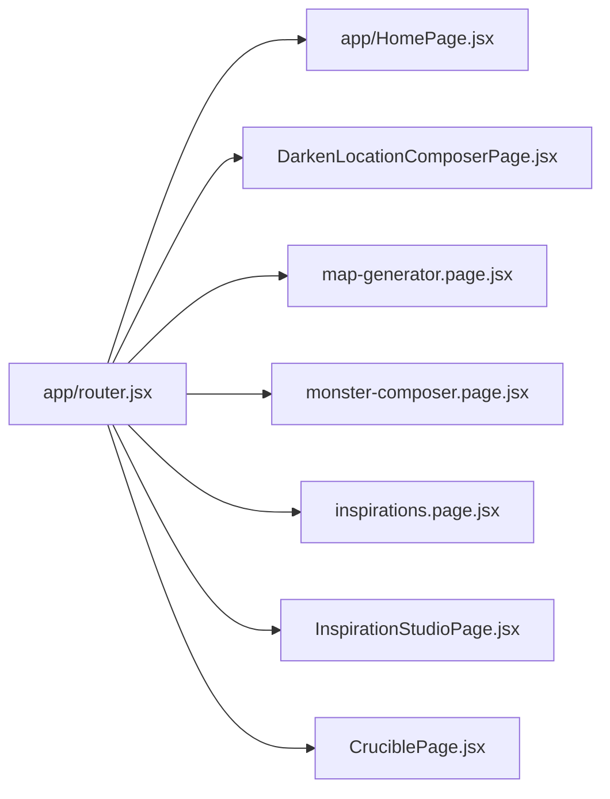

# Routes And Navigation

Routing is custom and centralized in `app/router.jsx`. There is no React Router dependency in the current app.

## Public Routes

- `/`: Home.
- `/darkplaces`: Darken a Location composer.
- `/darkplaces/map`: Map Generator route.
- `/terrifyingmonsters`: Monster Composer.
- `/inspirations`: Inspirations archive.
- `/inspiration-studio`: Inspiration Studio.

## Query Parameters And Compatibility Entrypoints

`app/router.jsx` also supports query-driven compatibility modes and deep links:

- `studio=1` or `admin=studio`: opens Inspiration Studio.
- `section=inspirations`: opens Inspirations.
- `section=crucible`: opens Crucible.
- `tool`, `generator`, `view`, and `darkenView`: select internal Crucible or Darken views.
- `cruorTest=dark-places` or `testHarness=dark-places`: Dark Places test harness behavior.

These are route selection inputs, not separate page files.

## Internal Navigation State

The router owns:

- active section.
- active UI mode.
- active locale.
- active Crucible generator.
- active Darken tab.
- whether the map generator has been opened.
- current map request and revision.
- Monster Composer inspiration seed.
- Darken snapshot provider ref.

Navigation mutates browser history with `window.history.pushState` and `window.history.replaceState`, listens for `popstate`, and may use `window.confirm` to protect unsaved transitions. Not all internal UI state is URL-backed; feature-local panel, filter, selection, and editor states remain inside feature pages.

## Route To Page Mapping

## Navigation Risk

`app/router.jsx` is critical risk: it owns browser URL state, app-level state, cross-feature callbacks, and recovery prompts. Changes should be tested with direct route loads and browser back/forward behavior.

