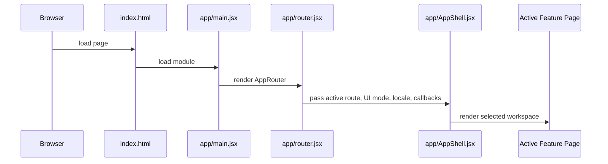
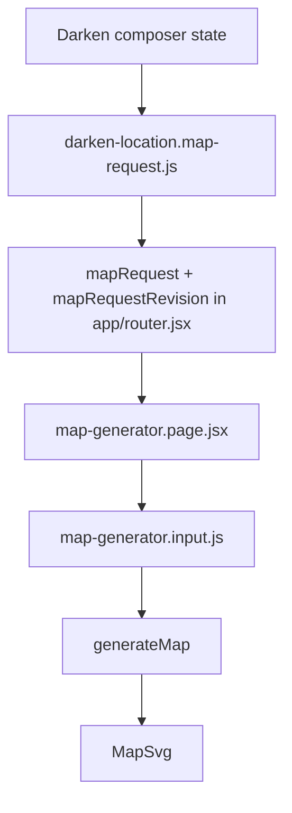

# Runtime Flows

## Application Startup

Startup also applies global styles, tooltip runtime setup, and accessibility settings.

## Navigation Flow

User navigation enters `app/router.jsx`, where route helpers translate paths and query parameters into active section and feature state. The router updates history, renders `AppShell`, and passes feature-specific callbacks. Browser back/forward enters through `popstate` and rehydrates route state from the current URL.

## Inspiration Archive Flow

Static content packs feed `shared/content/static-registry.js`; `shared/content/registry.js` normalizes inspirations, source anchors, taxonomies, components, workflows, and slots. `features/inspirations/inspirations.page.jsx` builds filtered/sorted views, opens detail state, and can call back into the router to open Monster Composer with an inspiration seed.

## Darken A Location Flow

`features/darken-location/composer/DarkenLocationComposerPage.jsx` owns workflow selections, active slot/scope, selected regions, draft status, builder mode, drawer state, and export status. It composes location frame data through model helpers under `features/darken-location/composer/model/`. Draft recovery uses `features/darken-location/composer/model/location-composer-draft.js`.

## Composer To Map Flow

The map request is the boundary between Darken output and Map Generator input. The router increments a request revision so the map page can distinguish a changed upstream request from local editor state.

## Map Generation Flow

`generateMap` in `features/darken-location/map-generator/map-generator.pipeline.js` normalizes input and manual overrides, builds or accepts an explicit region graph, places regions, applies manual room position/size/style overrides, builds masks, routes corridors, applies circular extensions, sets level metadata, builds the dungeon mask, computes bounds, finalizes cave/hybrid geometry, reconciles map accesses, creates props, checks physical connectivity, and chooses the best layout candidate by score.

Seeded generation is deterministic where the pipeline uses seeded hashing/random helpers. Editor-time overrides can rebuild derived geometry and are separate from the initial generated candidate selection.

## Map Editor Interaction Flow

`map-generator.page.jsx` owns editor selection, room dragging, manual overrides, corridor creation, endpoint and anchor edits, zoom, pan, map menus, debug recorder state, SVG serialization, clipboard copy, and downloads. `map-generator.state.js` defines manual override state shape. `map-generator.render.jsx` renders final and preview SVG geometry.

## Monster Composer Flow

Monster Composer combines workflow definitions, slot taxonomy, native graft data, registry-fed grafts, selected grafts, source/category/role/tactical/tier/tempo/danger settings, and output compilation. Public/debug export models are separate. Live stat block export opens a secondary window and writes its own document.

## Save And Recovery Flow

- Accessibility settings: `cruor.accessibility`.
- Darken composer draft: `cruor:darken-location-composer:draft:v1`.
- Inspiration Studio rail widths: `cruor-studio-library-rail-size`, `cruor-studio-right-rail-size`.
- Map debug coordinates: `cruorMapDebugCoordinates`.

Storage failures are generally caught and ignored so restricted browser contexts do not crash the app.

## Export Flow

Exports include JSON/text downloads from QA and debug tools, SVG serialization from the map editor, clipboard copies, Monster Composer stat block copy, and Inspiration Studio generated JSON downloads. Blob and object URL behavior is concentrated in map, studio, and script/export modules.
