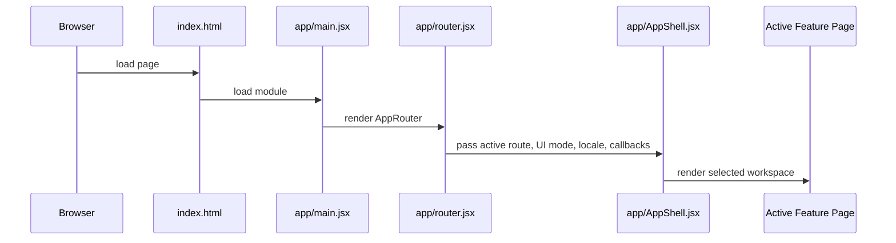
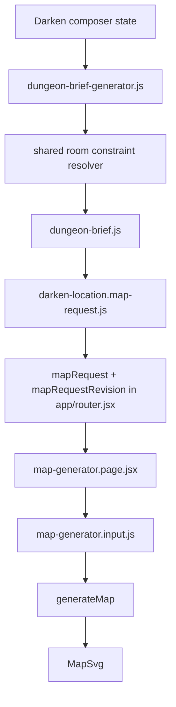

# Runtime Flows

## Application Startup

Startup also applies global styles, tooltip runtime setup, and accessibility settings.

## Navigation Flow

User navigation enters `app/router.jsx`, where route helpers translate paths and query parameters into active section and feature state. The router updates history, renders `AppShell`, and passes feature-specific callbacks. Browser back/forward enters through `popstate` and rehydrates route state from the current URL.

## Inspiration Archive Flow

Static content packs feed `shared/content/static-registry.js`; `shared/content/registry.js` normalizes inspirations, source anchors, taxonomies, components, workflows, and slots. `features/inspirations/inspirations.page.jsx` builds filtered/sorted views, opens detail state, and can call back into the router to open Monster Composer with an inspiration seed.

## Darken A Location Flow

`features/darken-location/composer/DarkenLocationComposerPage.jsx` owns workflow selections, active slot/scope, selected regions, draft status, builder mode, drawer state, assignment history, and export status. It composes location frame data through model helpers under `features/darken-location/composer/model/`. Region-scoped assignment changes pass through `location-room-assignment-transaction.js`, which validates the candidate, applies any explicit replacement, and commits assignments plus derived room-constraint state as one transaction. Draft recovery uses `location-composer-draft.js`; stale derived room metadata is discarded by signature checks before persistence or restoration.

## Composer To Map Flow

The Dungeon Brief resolves all assigned room metadata before the map request is created. Compatible contributions produce a single `effectiveRoomDesign`; incompatible hard constraints produce a structured, versioned report rather than a silent last-write-wins result. The effective design is also kept in the legacy `roomDesign` field consumed by Map Generator. Before a region-scoped component is assigned, `room-constraint-evaluation.js` compares the current room solution with the candidate solution. The Component Picker exposes compatible, transforming, warning, incompatible, unsupported, and explicit-replacement outcomes without regenerating the map on hover. On commit, `location-room-assignment-transaction.js` repeats validation and updates the slot assignments and resolved room metadata atomically. Assignment, replacement, removal, Undo, and Redo therefore restore a coherent room solution. Composer preview source keys include assignment and room-resolution signatures, so the existing map pipeline rebuilds geometry and reconciles accesses when the effective design changes. The router increments a request revision so the map page can distinguish a changed upstream request from local editor state.

## Map Generation Flow

`generateMap` in `features/darken-location/map-generator/map-generator.pipeline.js` normalizes input and manual overrides, builds or accepts an explicit region graph, places regions, applies manual room position/size/style overrides, builds semantic masks from the canonical shape identity, routes corridors against those masks, applies circular extensions, sets level metadata, builds the dungeon mask, computes bounds, finalizes cave/hybrid geometry, reconciles map accesses, creates props, checks physical connectivity, and chooses the best layout candidate by score. Explicit room-design shapes bypass inferred archetype masks unless an explicit `maskProfile` requests one.

Seeded generation is deterministic where the pipeline uses seeded hashing/random helpers. Editor-time overrides can rebuild derived geometry and are separate from the initial generated candidate selection.

## Map Editor Interaction Flow

`map-generator.page.jsx` owns editor selection, room dragging, manual overrides, corridor creation, endpoint and anchor edits, zoom, pan, map menus, debug recorder state, SVG serialization, clipboard copy, and downloads. Room style menu choices are evaluated against the same room constraints used by the Component Picker; incompatible shape, size, type, modifier, and custom-size choices are disabled, while reset returns the room to content-derived requirements. The room context menu reuses the Map Style root, section, flyout, option, active-state, and disabled-state layout rather than maintaining a parallel visual system. Its Shape branch is split into nested Standard Shapes and Special Shapes flyouts using the canonical `menuGroup` metadata from `shared/content/contracts/room-shapes.js`. The menu measures its rendered footprint through `map-generator.context-menu-position.js`, opens above or below the pointer according to viewport space, reserves space for the nested shape flyout, flips flyouts horizontally when needed, and uses bounded internal scrolling when the viewport cannot contain the full panel. `map-generator.state.js` defines manual override state shape. `map-generator.render.jsx` renders final and preview SVG geometry.

The Dark Places map toolbar also owns an immersive-mode toggle. While active, the composer omits both rails, the component navigator, the export context panel, and the guided-flow dock from the stage render. Feature-scoped CSS hides the global site topbar and expands the active composer, stage, and map center to the full viewport. Turning the toggle off restores the previous composer state without rebuilding the map.

## Monster Composer Flow

Monster Composer combines workflow definitions, slot taxonomy, native graft data, registry-fed grafts, selected grafts, source/category/role/tactical/tier/tempo/danger settings, and output compilation. Public/debug export models are separate. Live stat block export opens a secondary window and writes its own document.

## Save And Recovery Flow

- Accessibility settings: `cruor.accessibility`.
- Darken composer draft: `cruor:darken-location-composer:draft:v1`; valid room-constraint state is persisted with assignment/input signatures, while stale derived entries are omitted.
- Inspiration Studio rail widths: `cruor-studio-library-rail-size`, `cruor-studio-right-rail-size`.
- Map debug coordinates: `cruorMapDebugCoordinates`.

Storage failures are generally caught and ignored so restricted browser contexts do not crash the app.

## Export Flow

Exports include JSON/text downloads from QA and debug tools, SVG serialization from the map editor, clipboard copies, Monster Composer stat block copy, and Inspiration Studio generated JSON downloads. Blob and object URL behavior is concentrated in map, studio, and script/export modules.
