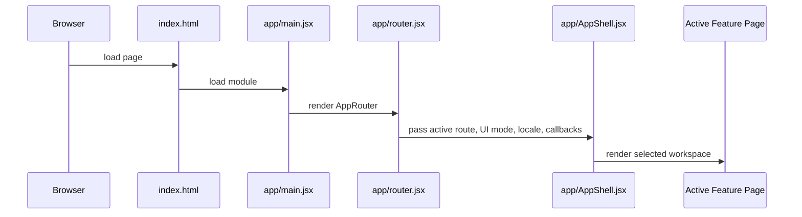
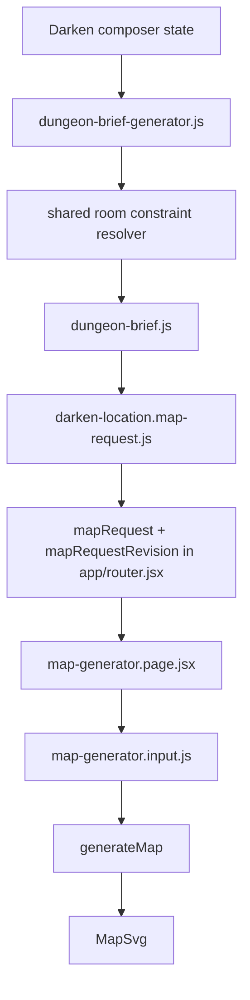
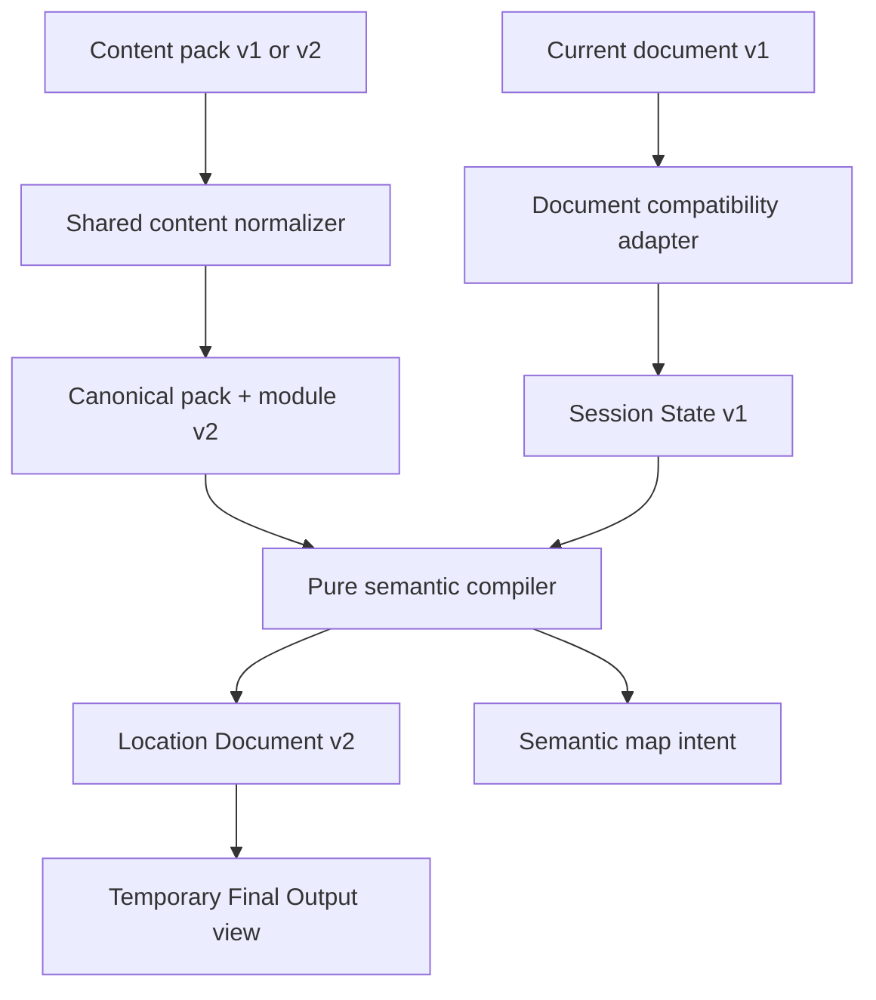

# Runtime Flows

## Application Startup

Startup also applies global styles, tooltip runtime setup, and accessibility settings.

## Navigation Flow

User navigation enters `app/router.jsx`, where route helpers translate paths and query parameters into active section and feature state. The router updates history, renders `AppShell`, and passes feature-specific callbacks. Browser back/forward enters through `popstate` and rehydrates route state from the current URL.

## Inspiration Archive Flow

Static content packs feed `shared/content/static-registry.js`; `shared/content/registry.js` normalizes inspirations, source anchors, taxonomies, components, workflows, and slots. `features/inspirations/inspirations.page.jsx` builds filtered/sorted views, opens detail state, and can call back into the router to open Monster Composer with an inspiration seed.

## Inspiration Studio v2 Flow

Inspiration Studio loads the shared module catalog for editing. In Phase 8,
Sedlec, Decomposition, and The Mist are canonical v2, while the other 11 entries
cross `normalizeSemanticContent()` before entering the v2-aware draft. A JSON file
import may contain a canonical Content Pack v0.2,
Inspiration Module v2, or a transitional v1 module. The Studio import adapter
retains structured Monster graft data inside the bounded semantic details
payload, while the editor registry selects the existing Monster/location editor
family or a reserved Phase 7 semantic editor id.

Copy and download actions rebuild a fresh contract value and call canonical
semantic serialization. They can emit only `cruor-inspiration-module-v2` or
`cruor-content-pack-v0.2`; private draft context, preview object URLs, and legacy
top-level fields are discarded. Re-importing an unchanged v2 module or pack is
byte-stable.

Phase 7 activates specialized editors for every Dark Places semantic type. Each
normal control is linked to an exact schema path. The Preview section builds
canonical input from the current draft and explicit seed/context/intrusion/room
controls, invokes the real pure semantic compiler, and renders Overview, At the
Table, or Rooms from Location Document v2. Health, Coverage, Readiness, and
Warnings report v1/v2 migration and semantic gaps without changing content.
This flow does not write to the production registry or switch active Composer
consumers.

The separate Phase 8 migration registry records migration, coverage, sample-QA,
human-review, and publication-blocker state. It is not serialized into authored
module semantics. Sedlec records Danilo's approval on 2026-07-16;
Decomposition revision 2 and The Mist candidate 1 record his approvals on
2026-07-17 after local QA passed. Decomposition's 26 Monster grafts use explicit
v2 semantic details in Studio. The Mist's Orientation Drift track exposes route
evidence, discrepancies, counterplay, and the final breach without changing real
topology. Both local card images remain blocked pending provenance and final alt
text. The active v0.1 Archive registry remains unchanged.

## Darken A Location Flow

`features/darken-location/composer/DarkenLocationComposerPage.jsx` owns workflow selections, active slot/scope, selected regions, draft status, builder mode, drawer state, assignment history, and export status. It composes location frame data through model helpers under `features/darken-location/composer/model/`. Region-scoped assignment changes pass through `location-room-assignment-transaction.js`, which validates the candidate, applies any explicit replacement, and commits assignments plus derived room-constraint state as one transaction. Draft recovery uses `location-composer-draft.js`; stale derived room metadata is discarded by signature checks before persistence or restoration.

## Composer To Map Flow

The Dungeon Brief resolves all assigned room metadata before the map request is created. Compatible contributions produce a single `effectiveRoomDesign`; incompatible hard constraints produce a structured, versioned report rather than a silent last-write-wins result. The effective design is also kept in the legacy `roomDesign` field consumed by Map Generator. Before a region-scoped component is assigned, `room-constraint-evaluation.js` compares the current room solution with the candidate solution. The Component Picker exposes compatible, transforming, warning, incompatible, unsupported, and explicit-replacement outcomes without regenerating the map on hover. On commit, `location-room-assignment-transaction.js` repeats validation and updates the slot assignments and resolved room metadata atomically. Assignment, replacement, removal, Undo, and Redo therefore restore a coherent room solution. Composer preview source keys include assignment and room-resolution signatures, so the existing map pipeline rebuilds geometry and reconciles accesses when the effective design changes. The router increments a request revision so the map page can distinguish a changed upstream request from local editor state.

## Semantic Compiler Flow

Phase 2 adds an inactive-by-default semantic compiler path alongside the current Composer export. Phase 3 supplies the first in-review semantic pack and activates Place Identity, scaled site-wide systems, and Recurring Sign allocation within that path. Phase 4 activates sensory allocation and Read-Aloud composition. Phase 5 builds the clue graph and operational Session Guide and exposes it through the temporary Final Output view without adopting the pack in the production Composer registry. Legacy content enters only through the shared content normalizer. The current derived location document enters through a document-specific compatibility adapter that creates canonical compiler Session State; it does not read or write content records.

After component resolution, Phase 3 composes the two-part identity, resolves atmosphere/rules/stakes, applies centralized intrusion scaling, and allocates bounded Recurring Sign variations to compatible rooms. Phase 4 then derives route-aware intensity, assigns exact-unique sensory variants plus one room-context bias, filters spoiler-tagged fragments, and composes compact/standard/extended Read-Aloud text. Phase 5 resolves authored rules into pressure and always-on references, anchors revelation nodes to room evidence, validates required clue availability, retains authored stall moves, and orders shortcuts by authored pacing. All choices use explicit source data and stable semantic ids; the standard Read-Aloud and structured Session Guide are projected into the temporary v1 renderer view. The compiler rejects non-canonical pack/module/session inputs and returns deeply frozen deterministic data. Semantic map intent is adapted into the current map-request vocabulary through one pure boundary; no Map Generator, React, SVG, DOM, storage, network, clock, or random-global module is imported by the compiler.

At runtime, `LocationOutputWorkspace.jsx` creates `cruor-location-session-dashboard-state-v1` separately from the normalized document. Pressure values and discovered revelation ids are bounded by the compiled guide. Optional persistence uses build id plus document schema version; reset affects only this operational state. The dashboard uses native controls and existing room navigation, while legacy documents without a structured guide keep the previous At the Table block rendering.

## Map Generation Flow

`generateMap` in `features/darken-location/map-generator/map-generator.pipeline.js` normalizes input and manual overrides, builds or accepts an explicit region graph, places regions, applies manual room position/size/style overrides, builds semantic masks from the canonical shape identity, routes corridors against those masks, applies circular extensions, sets level metadata, builds the dungeon mask, computes bounds, finalizes cave/hybrid geometry, reconciles map accesses, creates props, checks physical connectivity, and chooses the best layout candidate by score. Explicit room-design shapes bypass inferred archetype masks unless an explicit `maskProfile` requests one.

Seeded generation is deterministic where the pipeline uses seeded hashing/random helpers. Editor-time overrides can rebuild derived geometry and are separate from the initial generated candidate selection.

## Map Editor Interaction Flow

`map-generator.page.jsx` owns editor selection, room dragging, manual overrides, corridor creation, endpoint and anchor edits, zoom, pan, map menus, debug recorder state, SVG serialization, clipboard copy, and downloads. Room style menu choices are evaluated against the same room constraints used by the Component Picker; incompatible shape, size, type, modifier, and custom-size choices are disabled, while reset returns the room to content-derived requirements. The room context menu reuses the Map Style root, section, flyout, option, active-state, and disabled-state layout rather than maintaining a parallel visual system. Its Shape branch is split into nested Standard Shapes and Special Shapes flyouts using the canonical `menuGroup` metadata from `shared/content/contracts/room-shapes.js`. The menu measures its rendered footprint through `map-generator.context-menu-position.js`, opens above or below the pointer according to viewport space, reserves space for the nested shape flyout, flips flyouts horizontally when needed, and uses bounded internal scrolling when the viewport cannot contain the full panel. `map-generator.state.js` defines manual override state shape. `map-generator.render.jsx` renders final and preview SVG geometry.

The Dark Places map toolbar also owns an immersive-mode toggle. While active, the composer omits both rails, the component navigator, the export context panel, and the guided-flow dock from the stage render. Feature-scoped CSS hides the global site topbar and expands the active composer, stage, and map center to the full viewport. Turning the toggle off restores the previous composer state without rebuilding the map.

## Monster Composer Flow

Monster Composer combines workflow definitions, slot taxonomy, native graft data, registry-fed grafts, selected grafts, source/category/role/tactical/tier/tempo/danger settings, and output compilation. Public/debug export models are separate. Live stat block export opens a secondary window and writes its own document.

## Save And Recovery Flow

- Accessibility settings: `cruor.accessibility`.
- Darken composer draft: `cruor:darken-location-composer:draft:v1`; valid room-constraint state is persisted with assignment/input signatures, while stale derived entries are omitted.
- Inspiration Studio rail widths: `cruor-studio-library-rail-size`, `cruor-studio-right-rail-size`.
- Map debug coordinates: `cruorMapDebugCoordinates`.

Storage failures are generally caught and ignored so restricted browser contexts do not crash the app.

## Export Flow

Exports include JSON/text downloads from QA and debug tools, SVG serialization from the map editor, clipboard copies, Monster Composer stat block copy, and canonical Inspiration Studio v2 JSON downloads. Blob and object URL behavior is concentrated in map, studio, and script/export modules.
