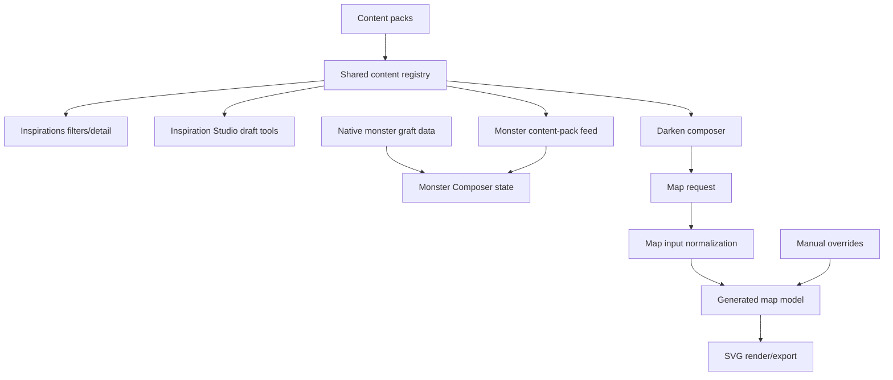

# State And Data Flow

## Sources Of Truth

| Domain | Owner | Consumers | Persistence |
| --- | --- | --- | --- |
| Route and active page | `app/router.jsx` | `AppShell`, feature pages | URL/history |
| Accessibility settings | `shared/accessibility/accessibility.settings.js`, `app/AppShell.jsx` | document root, topbar controls | `localStorage` key `cruor.accessibility` |
| Shared content registry | `shared/content/static-registry.js`, `shared/content/registry.js` | Inspirations, Studio, Darken, Monster | source files |
| Darken composer draft | `DarkenLocationComposerPage.jsx` and draft helpers | Darken UI, map request builder | `localStorage` key `cruor:darken-location-composer:draft:v1` |
| Map request | `app/router.jsx` and `darken-location.map-request.js` | Map Generator page | React state |
| Generated map model | `map-generator.pipeline.js` | renderer, editor, export tools | derived runtime state |
| Manual map overrides | `map-generator.page.jsx`, `map-generator.state.js` | pipeline, render, export | runtime state and import/export payloads |
| Inspiration filters | `inspirations.page.jsx` | Inspiration list/detail UI | React state |
| Studio draft | `InspirationStudioPage.jsx` | Studio panels, validation, export | React state and browser exports |
| Monster build | `monster-composer.page.jsx` | Monster UI and export model | React state |

## Fragile Relationships

- Route state and feature state overlap in `app/router.jsx`; some UI state is URL-backed while panel/editor/filter state is not.
- Darken composer output and Map Generator input are synchronized through a request object and revision counter. Local map edits can diverge from upstream composer changes.
- Map editor state mixes model overrides, preview geometry, pointer interaction state, SVG serialization, and debug QA state in one page component.
- Monster Composer combines native graft data with registry-fed content-pack grafts. The translation layer is current but transitional.
- Inspiration Studio reads many shared content models while also maintaining its own draft module state, making it sensitive to shared schema changes.

